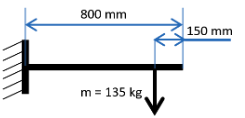
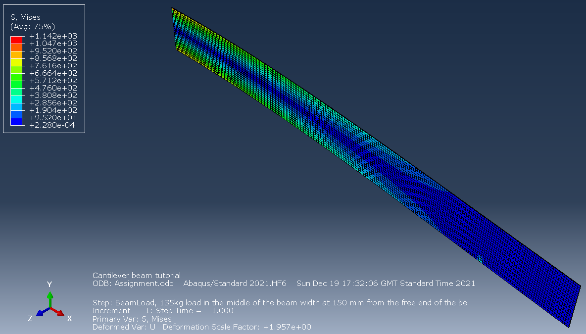
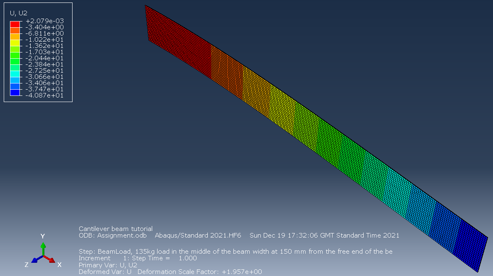

# Finite Element Analysis for A Cantilever Beam

The goal of this assignment lies in the determination of the **correlation between the numbers of elements, namely the seeds global size, and the quality of FEA simulations**, regarding the precision of maximum stresses and deflections on the y axis. 

A comparison between the **theoretical stress calculations** and the **computer-based results** will be conducted. In the end, the optimal solution will be applied to analyse a new loading condition on the same cantilever beam.

| Yield Strength  | Ultimate Strength | Strain| Young's Modulus | Poisson’s ratio |
| ------------- | ------------- |--------|---|--|
| 1120 MPa  | 1210 MPa  | 13% |114 GPa | 0.33 |

The cantilever beam has a length of 800 mm and a mass is hung at the point 150 mm away from the free end of the beam. Meanwhile, its cross section is rectangular, and the height and the width are 75 mm and 1 mm respectively. The material related parameters are listed in Table.

 
